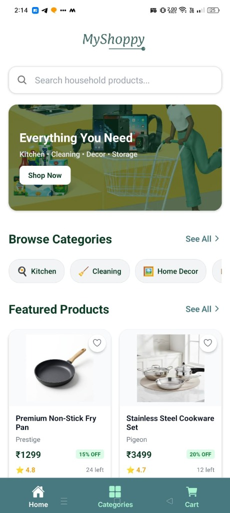
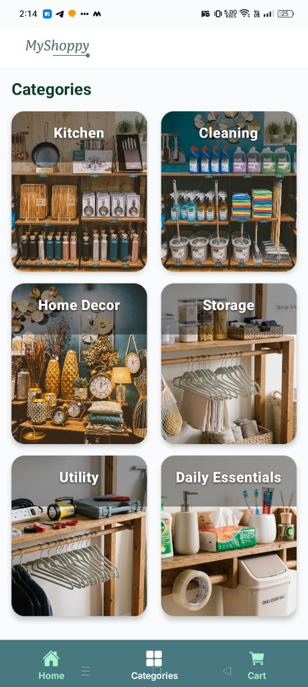
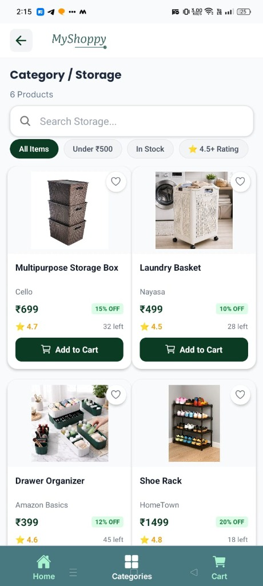
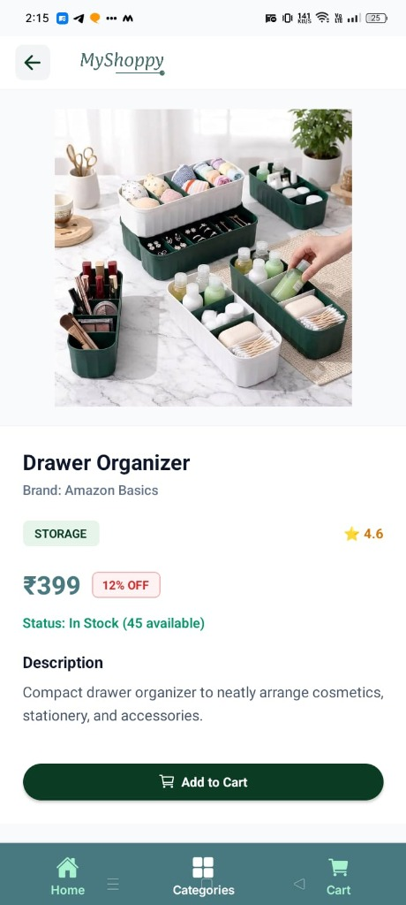
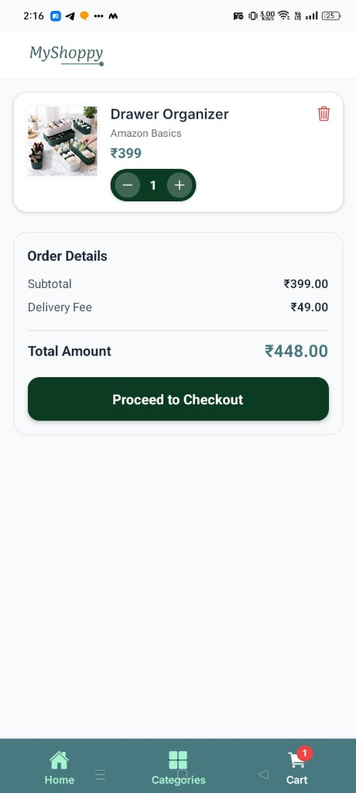
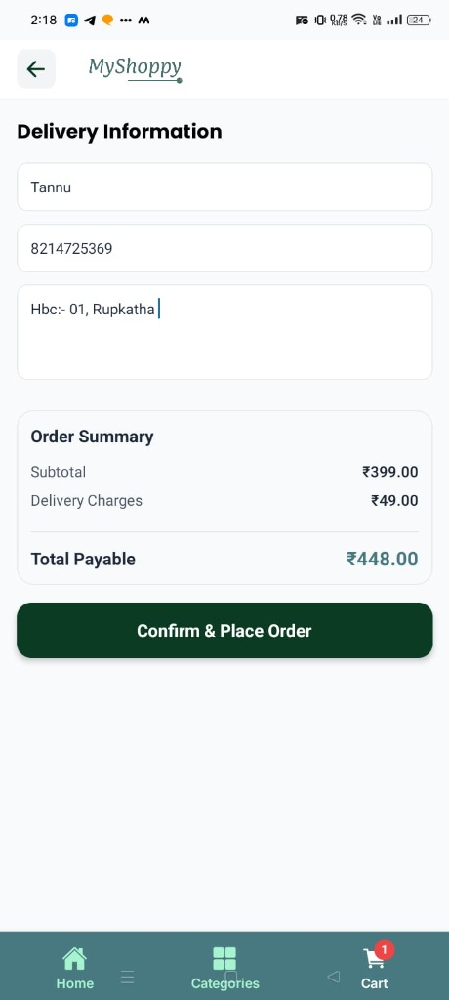
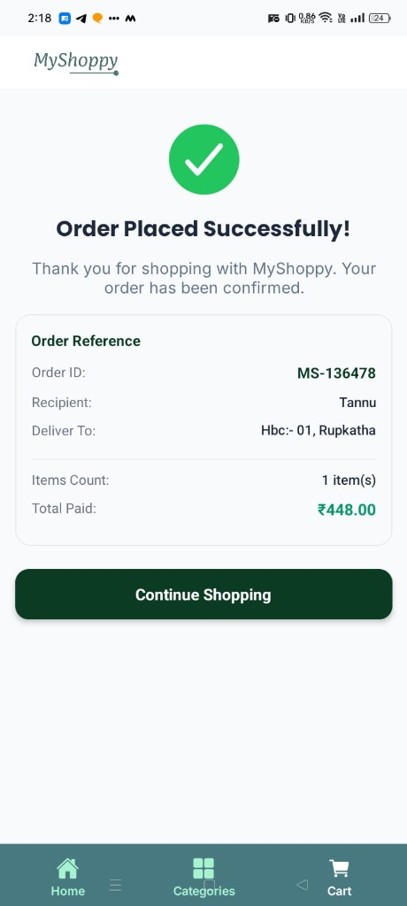

# 🛍️ myShoppy - Mobile & Web E-Commerce Application

**myShoppy** is a modern, mobile-first e-commerce application developed in **React Native (Expo SDK 54)** for household products. It provides an intuitive, end-to-end shopping experience—from product discovery and department-wise category browsing to real-time cart management, checkout input validation, and order confirmation.

---

## 📸 Application Screenshots & User Flow

| Home Screen | Categories Screen | Catalog & Filters | Product Details | Cart Screen | Checkout Screen | Order Success |
| :---: | :---: | :---: | :---: | :---: | :---: | :---: |
|  |  |  |  |  |  |  |

### Core Screens Overview
1. **Home Screen** (`home.jpg`): Search bar, Hero Banner ("Everything You Need"), quick category pills, and Featured Products grid with un-cropped images and favorite heart toggles.
2. **Categories Screen** (`categories.jpg`): 2-column poster-card layout for Kitchen, Cleaning, Home Decor, Storage, Utility, and Daily Essentials.
3. **Products Catalog & Filters** (`products_catalog.jpg`): Category breadcrumb, instant search bar, and interactive filter chips (*All Items*, *Under ₹500*, *In Stock*, *4.5+ Rating*).
4. **Product Details View** (`product_details.jpg`): Complete un-cropped product photo (`resizeMode="contain"`), brand details, stock status, discount badge, and Add to Cart action button.
5. **Cart Screen** (`cart.jpg`): Real-time item additions, `- quantity +` pill controls, item deletion, subtotal calculation, delivery fee, and live tab badge counter.
6. **Checkout Screen** (`checkout.jpg`): Input form validation for Full Name, 10-digit Phone Number, and Address with order summary recap.
7. **Order Success Screen** (`order_success.jpg`): Instant order reference ID (`MS-XXXXXX`), recipient summary, total paid, and automated navigation stack reset.


---

## 🎯 Capstone Requirements Coverage & Evaluation Matrix

| Deliverable / Requirement | Description | Implementation Status |
| :--- | :--- | :---: |
| **Product Catalog** | 36 household products across 6 categories with images, ratings, discounts, and stock status. | ✅ **100% Completed** |
| **Category Browsing** | 2-column poster cards for Kitchen, Cleaning, Home Decor, Storage, Utility, and Daily Essentials. | ✅ **100% Completed** |
| **Search & Filtering** | Instant search by product name/brand, price range filters, and availability chips (*Under ₹500*, *In Stock*, *4.5+ Rating*). | ✅ **100% Completed** |
| **Product Details** | Full un-cropped product image view (`resizeMode="contain"`), brand info, discount badges, and live quantity pill controls. | ✅ **100% Completed** |
| **Shopping Cart** | Interactive `- quantity +` pill controls, item removal, subtotal calculation, delivery fee, and live tab badge counter. | ✅ **100% Completed** |
| **Checkout & Form Validation** | Input validation for Full Name, 10-digit Phone Number, and Address, with Order ID generation (`MS-XXXXXX`) and stack reset. | ✅ **100% Completed** |
| **Responsive UI Design** | Custom design system supporting mobile phones, tablets, and web browser viewports with `maxWidth: 800` centering. | ✅ **100% Completed** |
| **Code Quality & Type Safety** | Clean React Native Expo SDK 54 codebase with TypeScript (`npx tsc --noEmit` clean with 0 errors). | ✅ **100% Completed** |

---

## 🏗️ Architecture & Technology Stack

- **Core Framework**: React Native (0.81), Expo (SDK 54), React Navigation 7
- **Language**: TypeScript (`npx tsc --noEmit` verified clean with 0 errors)
- **State Management**: React Context API (`CartContext`) with `useCallback` & `useMemo` optimizations
- **Design System**: Vanilla React Native `StyleSheet` tokens for colors (`#0C3B24` brand green), typography, and shadows
- **Icons & Assets**: `@expo/vector-icons` (Ionicons) and vector brand logo assets

---

## 🚀 Quick Start Instructions

### Prerequisites
- Node.js `20.19.0` or higher
- npm or yarn

### Installation & Local Execution

1. **Install Dependencies**:
   ```bash
   npm install
   ```

2. **Run on Web**:
   ```bash
   npm run web
   ```
   *Press `w` in terminal to open browser window.*

3. **Run on Mobile Device / Emulator**:
   ```bash
   npm run android  # For Android Emulator / Device
   npm run ios      # For iOS Simulator
   ```

4. **Verify Type-Safety**:
   ```bash
   npx tsc --noEmit
   ```

---

## 📱 User Journey & Navigation Flow

```
HomeScreen (Featured Products & Quick Categories)
 └── SearchBar / CategoriesScreen
      └── ProductsScreen (Category & Price Filters)
           └── ProductDetailsScreen (Un-cropped Image View & Cart Controls)
                └── CartScreen (Subtotal, Delivery Fee & Item Removal)
                     └── CheckoutScreen (Input Form Validation)
                          └── OrderSuccessScreen (Order Reference ID & Reset)
```

---

## 💡 Key Highlights & Engineering Solutions

- **Consistent Header Logo System**: Centered brand logo on Home, Top-Left logo image with optional back arrow across all other screens (`AppHeader`).
- **Un-Cropped Product Imagery**: `resizeMode="contain"` inside `#F8FAFC` image containers prevents product photos from being sliced across all device screens.
- **Card-Level Cart Actions**: Tapping **Add to Cart** on any card instantly converts to `- qty +` controls right on the card.
- **Single-Invocation Execution**: Fixed double add-to-cart invocation bugs across Home, Catalog, and Search screens.
- **Automated Stack Resets**: Tapping any tab icon (**Home**, **Categories**, **Cart**) or clicking "Continue Shopping" automatically resets that tab stack back to its root screen.


